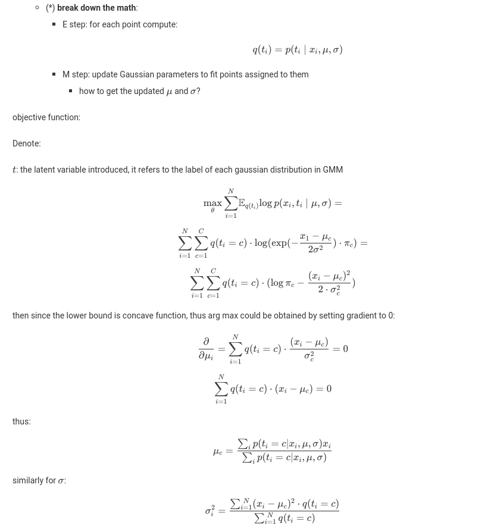
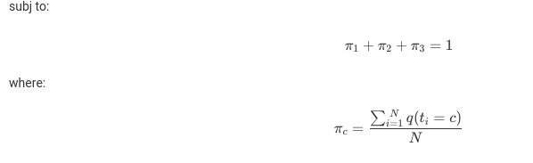

Homework 2: Image Segmentation Algorithms 
============

- OS: Ubuntu 18.04

- Python Version: 3.6.7

- PyQt Version: 5

----
### Algorithms Written from scratch


- [Kmeans](algorithms/kmeans.py) Clustering (k could be adjusted by users in the GUI)

- [Meanshift](algorithms/meanshift.py) Clustering (radius/bandwidth could be adjusted by users in the GUI)
    - only implemented with feature (color) bandwidth

- [Region Growing](algorithms/region_growing.py)

- [Gaussian Mixture Model](algorithms/gmm.py)






----

### Algorithms Written using functions from OpenCV

- [GrabCut](algorithms/grabcut_opencv.py)

- [Watershed](algorithms/watershed_opencv.py)


----

### [Test](test.mp4) 

```python
python3 main.py
```
